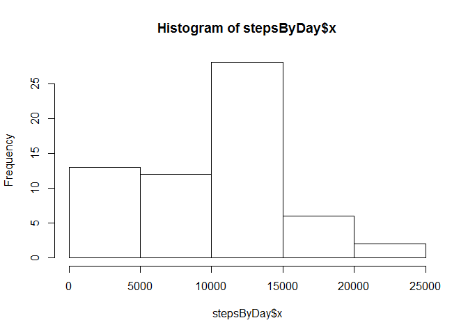
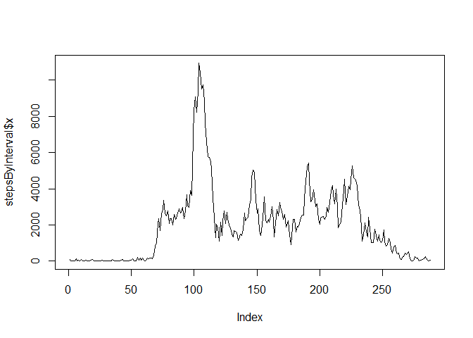
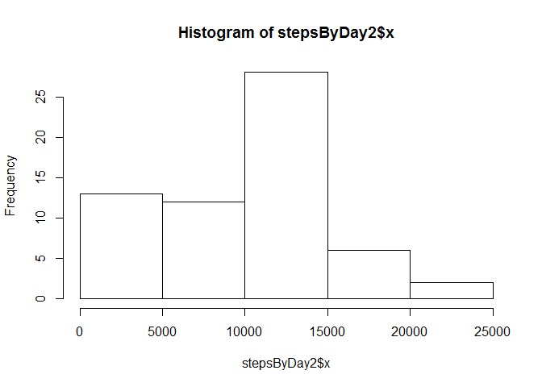
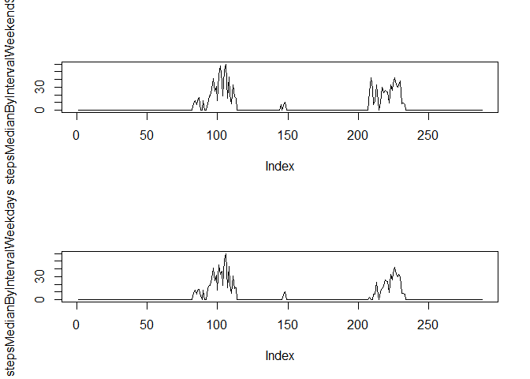

## Loading and preprocessing the data


```r
unzip("activity.zip")
data <- read.csv("activity.csv")
data$date <- as.Date(data$date, format = "%Y-%m-%d")
```

## What is mean total number of steps taken per day?

Histogram with the steps by day


```r
stepsByDay <- aggregate(data$steps, by=list(date=data$date), FUN=sum, na.rm=TRUE)


hist(stepsByDay$x)
```

<!-- -->

Mean of the steps by day


```r
mean(stepsByDay$x)
```

```
## [1] 9354.23
```

Median of the steps by day


```r
median(stepsByDay$x)
```

```
## [1] 10395
```


## What is the average daily activity pattern?


```r
stepsByInterval <- aggregate(data$steps, by=list(interval=data$interval), FUN=sum, na.rm=TRUE)

plot(stepsByInterval$x, type="l")
```

<!-- -->


## Imputing missing values

Total number of missing values


```r
sum(is.na(data$steps))
```

```
## [1] 2304
```

Fill missing values with the mean of the 5 minutes interval


```r
data2 <- data

stepsMedianByInterval <- aggregate(data2$steps, by=list(interval=data2$interval), FUN=median, na.rm=TRUE)

for (row in 1:nrow(data2)) {
	if(is.na(data2[row, "steps"])){
		data2[row, "steps"] <- stepsMedianByInterval[which(stepsMedianByInterval$interval==data2[row, "interval"]),]$x
	}
}
```

Histogram with the steps by day with missing values filled


```r
stepsByDay2 <- aggregate(data2$steps, by=list(date2=data2$date), FUN=sum, na.rm=TRUE)


hist(stepsByDay2$x)
```

<!-- -->

Mean of the steps by day with missing values filled


```r
mean(stepsByDay2$x)
```

```
## [1] 9503.869
```

Median of the steps by day with missing values filled


```r
median(stepsByDay2$x)
```

```
## [1] 10395
```

## Are there differences in activity patterns between weekdays and weekends?

Create a new factor valriable for weekdays and weekends


```r
weekdays1 <- c('lunes', 'martes', 'miercoles', 'jueves', 'viernes')

data2$dayType <- factor((weekdays(data2$date) %in% weekdays1), levels=c(FALSE, TRUE), labels=c('weekend', 'weekday'))
```

Plot to show differences between weekdays and weelends


```r
weekendData <- data2[data2$dayType %in% 'weekend',]
weekdayData <- data2[data2$dayType %in% 'weekday',]

stepsMedianByIntervalWeekend <- aggregate(weekendData$steps, by=list(interval=weekendData$interval), FUN=median, na.rm=TRUE)

stepsMedianByIntervalWeekdays <- aggregate(weekdayData$steps, by=list(interval=weekdayData$interval), FUN=median, na.rm=TRUE)

par(mfrow=c(2,1))

plot(stepsMedianByIntervalWeekend$x, type="l")
plot(stepsMedianByIntervalWeekdays$x, type="l")
```

<!-- -->
